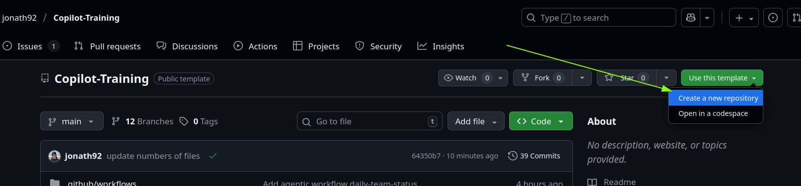
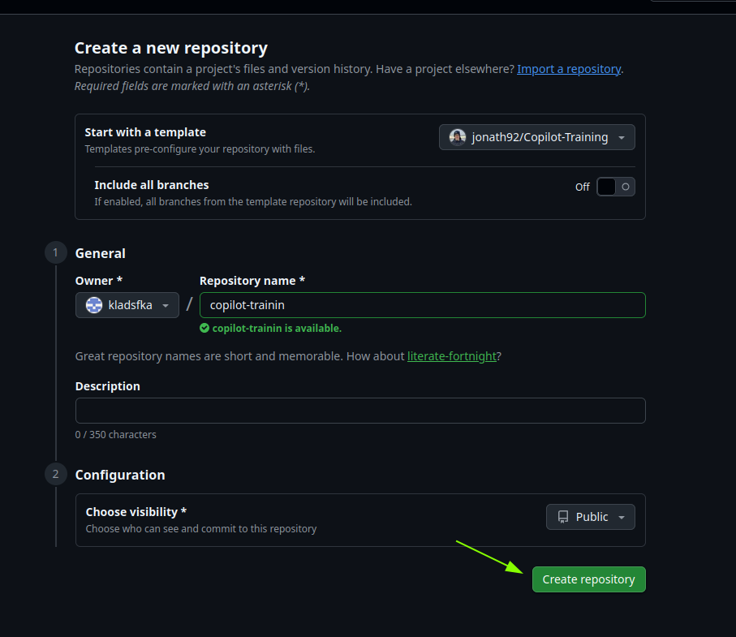
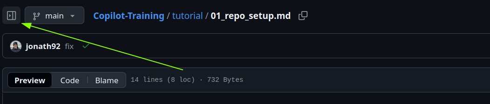

# Repository Setup

- Use this [repository](https://github.com/jonath92/Copilot-Training) as template to create a new repository 

- Give it a name of your choice and we recommend to keep the repository public for the duration of the training. This allows us to provide you better support in case you run into issues. 

- Clone the repository to your local machine and open it in Visual Studio Code or an IDE of your choice.

> [!WARNING]
> It is up to you to decide which IDE you want to use. But keep in mind that some features might not be available in all IDEs. The tutorials have been tested with Visual Studio Code only. 

- It is recommended to keep the Tutorial Documents open in a Browser window while working on the tasks in the IDE. For better navigation, you can use the `Expand File Tree` view in Github

- Open the Copilot Chat view in your IDE and type `@workspace describe the repo`. It should give you a short summary of the repository. This is a [chart participant](https://code.visualstudio.com/docs/copilot/reference/copilot-vscode-features#_chat-participants) that helps you to get an overview of the repository at any time. Additional this will trigger the inital remote [indexing](https://code.visualstudio.com/docs/copilot/reference/workspace-context#_what-sources-are-used-for-context) of the repository 