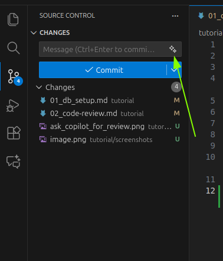

# Task
- Checkout a new branch
- Create a Dockerfile inside the "db" folder to set up a database service (e.g., PostgreSQL, MySQL).
- Create a database initialization script to create the necessary tables for storing tasks with the following fields: ID, Title, Description, Duration
- Commit and push your changes 

# Tips and Tricks

- Use the "Agent" mode in the Copilot Chat 
- Select the 2nd and 3rd bullet point from above and reference the selection by typing `#selection` in the chat input and click on "Send". Hint: you can get a vscode cheatshet for Copilot [here](https://code.visualstudio.com/docs/copilot/reference/copilot-vscode-features)
- Switch to "Ask" mode to get infos on how to run it
- You can autogenerate the Commit Message in VSCode 

# FAQ

## How much does it cost me? 

> If you're on a paid plan, you get unlimited inline suggestions and unlimited chat interactions using the included models (GPT-5 mini, GPT-4.1 and GPT-4o). Rate limiting is in place to accommodate for high demand. See Rate limits for GitHub Copilot. [docs](https://docs.github.com/en/copilot/concepts/billing/copilot-requests)

You can see your current usage in percent [here](https://github.com/settings/copilot/features). The total number of premium request per month depends on [your plan](https://docs.github.com/en/copilot/get-started/plans#comparing-copilot-plans). 

The number of premium requests used for chat interactions depends on the [model](https://docs.github.com/en/copilot/concepts/billing/copilot-requests#model-multipliers) you select (for some models no premium request is used) and the [feature](https://docs.github.com/en/copilot/concepts/billing/copilot-requests#premium-features) you use

If you do many request, you might be rate limited (https://docs.github.com/en/copilot/concepts/rate-limits#what-to-do-if-you-are-rate-limited). 

## Which model should I choose?
While the suggestion is partially a personal preference, GitHub provides some guidance on which model to use for which task in the [docs](https://docs.github.com/en/copilot/reference/ai-models/model-comparison#recommended-models-by-task). Keep in mind that using more powerful models will consume more of your premium requests.Alternatively you can use the [Auto model selection](https://docs.github.com/en/copilot/concepts/auto-model-selection#overview) feature, which automatically selects the best model for your task based on your usage patterns and model availability. That way you get a discount and reduce the chances of rate limiting. 

> [!NOTE]
> In a later chapter, we will have a look at custom modes in which you can select the model depending on the task.
