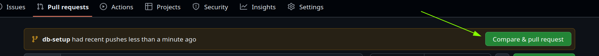
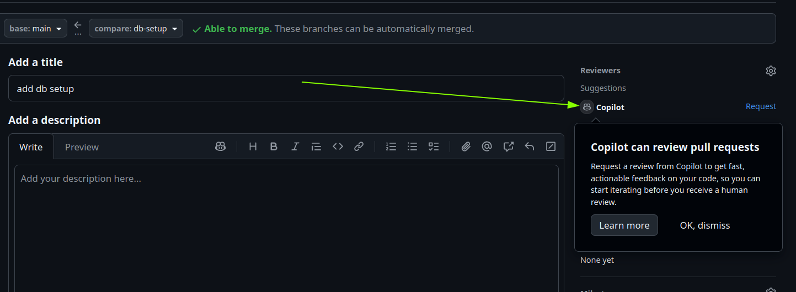
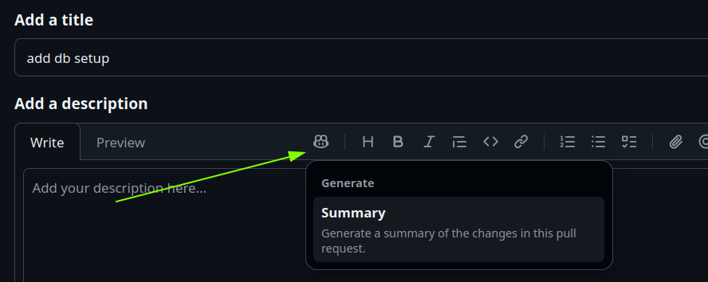

# Task
- Push the changes to your remote repository.
- Make a Pull Request (PR) for your changes.

- Request a code review from Copilot in the PR  

- Commit Suggestions made by Copilot in the PR or ignore its if not applicable
- Merge the PR once the review is complete.

# Tips and Tricks
- You can also ask Copilot to review your code [directly in the IDE](https://docs.github.com/en/copilot/how-tos/use-copilot-agents/request-a-code-review/use-code-review) 
- You can ask Copilot to generate a description of your changes 

- Bonus Task: Configure an automatic code review for every Pull Request by setting up a ruleset for your default branch. You can find the Instructions for this in the [docs](https://docs.github.com/en/copilot/how-tos/use-copilot-agents/request-a-code-review/configure-automatic-review#configuring-automatic-code-review-for-a-single-repository). In an enterprise setup, this can also be automated using the [GitHub Terraform provider](https://registry.terraform.io/providers/integrations/github/latest/docs).
