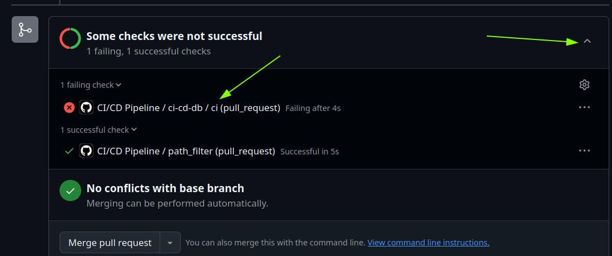
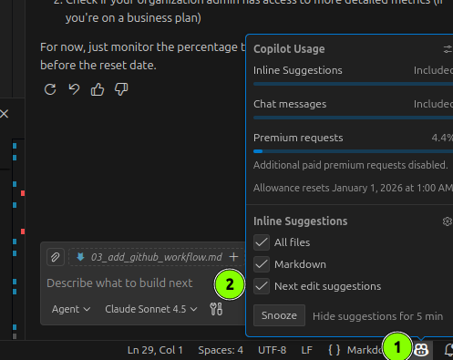

# Introduction
In modern Software Development, Continuous Integration and Continuous Deployment (CI/CD) are essential practices that help teams deliver high-quality software quickly and reliably. By automating the build, test, and deployment processes, CI/CD pipelines ensure that code changes are integrated smoothly and deployed to production with minimal manual intervention.

# Task 
In the `.github/workflows` directory, you already find a `ci_cd_db.yaml` GitHub Actions workflow file. This workflow is intended to check the database setup as part of the CI/CD process. For simplicity, we skip pushing the database as a Docker image to a container registry and only test the docker build process.

- Checkout out a new branch from the main branch.
- This time switch to the "Edit" mode in the Copilot Chat.

> Edit mode is perfect when you know what you want to do but don’t necessarily want to write it all out yourself. You highlight a block of code, type in an instruction—perhaps something like “add error handling” or “refactor this using async/await”—and Copilot rewrites the code for you. But (and this is important) it doesn’t save anything without showing you the diff first. [source](https://github.blog/ai-and-ml/github-copilot/copilot-ask-edit-and-agent-modes-what-they-do-and-when-to-use-them/)

- Go to the `ci_cd_db.yaml` file and select the area where the docker build should be implemented.
- Ask Copilot in the "Edit" mode to implement the docker build for the database service. Hint: Copilot might want to push the image to a container registry, which we do not want in this case. Undo the suggestion and update your prompt to ask Copilot to only implement the build process without pushing to a registry.
- Commit and push your changes to your remote repository and make a Pull Request to test if the workflow runs successfully. 

Click on the "Check" in the PR to inspect the workflow run. 

- Fix any issues that might arise in the workflow until the workflow runs successfully. Also double check that even if the workflows was successful, the docker build step was executed.

- Bonus: Add another step that checks if the database has been actually set up correctly. You can for example run a bash script that connects to the database container and checks if the necessary tables are created.

# Tips and Tricks

- We recommend to enable [Next edit suggestions](https://code.visualstudio.com/blogs/2025/02/12/next-edit-suggestions) in your IDE: 

- Hint: You can ask Copilot to explain the error in the Actions tab on github 
 

- We have build a generic CI/CD workflow in the `ci_cd.yaml` file. We are using the [dorny/paths-filter](https://github.com/dorny/paths-filter) to trigger specific workflows based on the changed files in a Pull Request. That way, we save money and time and can easily add additional workflows in the future.
- On your GitHub Account you have 2000 free minutes per month for GitHub Actions [see here](https://docs.github.com/en/get-started/learning-about-github/githubs-plans).
