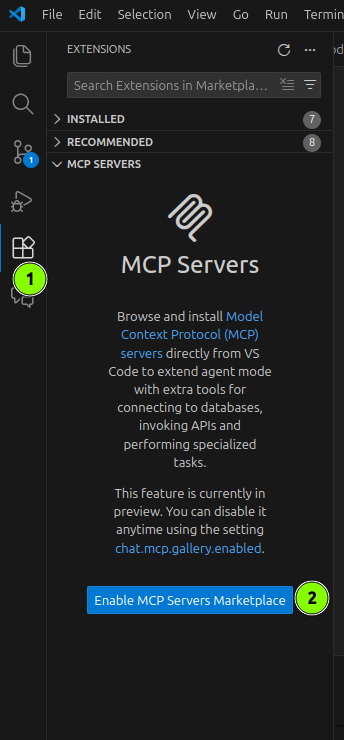
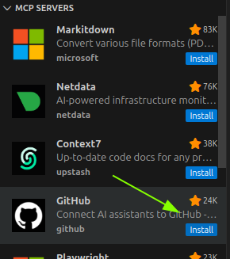
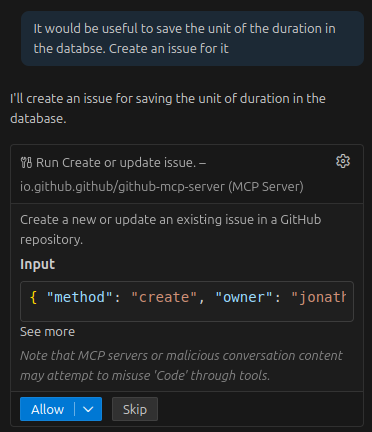

# Introduction
> Model Context Protocol (MCP) is an open standard that lets AI models use external tools and services through a unified interface. In VS Code, MCP servers provide tools for tasks like file operations, databases, or interacting with external APIs. [VS Code Docs](https://code.visualstudio.com/docs/copilot/advanced/mcp)

There are a lot of MCP Servers out there that provide different functionalities. In this task we will add the GitHub MCP server to our development environment. This will allow us to interact with GitHub directly from GitHub Copilot Chat in our IDE. For example, we can directly create an issue in our repository without leaving our IDE in a human friendly way. 

# Task
The following steps will guide you through the process of adding the GitHub MCP server in VS Code. For other IDEs please refer to the [official documentation](https://github.com/github/github-mcp-server?tab=readme-ov-file#install-in-other-mcp-hosts).

1. Open the VS Code Extensions view and click on "Enable MCP Servers Marketplace" if you haven't done so already.

2. Install the "GitHub MCP Server" from the Marketplace. If you are asked to enter a GitHub PAT, just leave the input field empty and continue. The MCP server will in that case ask you to login with your GitHub account in the Browser. 

3. Currently the unit of the duration is not saved in the databse. In the GitHub Copilot Chat, ask to create an issue for this. 

> [!CAUTION]
> MCP servers pose a [security risk](https://simonwillison.net/2025/Jun/16/the-lethal-trifecta/). Be careful when installing third-party MCP servers. 

# Tipps and Tricks
- MCP Servers can also be added by adding a `mcp.json` file to the `.vscode` folder in your workspace. See the [docs](https://code.visualstudio.com/docs/copilot/customization/mcp-servers#_other-options-to-add-an-mcp-server)
- You can find a list of available Tools for the GitHub MCP server by clicking on the "Configure Tools" button in the GitHub Copilot Chat view.

In the list you than can also enable or disable specific tools according to your needs.