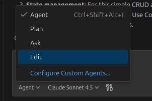

# Introduction
In this tutorial, we will add end-to-end tests to our application to verify that all components work together as expected. In this turoial we will explore GitHub Copilot's custom chat mode functionality to create a custom chat agent that is tailored to our specific use case.

For end2end tests, playwright has developed a [popular mcp server](https://github.com/microsoft/playwright-mcp?tab=readme-ov-file). While it is possible to use the mcp server directly, in the default agent mode, it is often better to create a custom chat agent that is specifically designed for a specific use case. The problem is that each MCP tool takes some amount of the model's [context window](https://demiliani.com/2025/09/04/model-context-protocol-and-the-too-many-tools-problem/). Therefore, adding too many mcp tools can impact the performance of the model negatively. 

# Task
- Install the [Playwright MCP Server](https://github.com/microsoft/playwright-mcp?tab=readme-ov-file) by following the instructions in the Readme.md file for your IDE.

- In the Chat Input, click on the dropdown next to the "Mode" button and select "Configure Custom Agent".

Give it a name of your choice and select "Workspace" as place to store the configuration. Now update the custom agent configuration to only include the Playwright MCP Tool. You again find an example for this is the [awesome copilot repository](https://github.com/github/awesome-copilot/blob/main/agents/playwright-tester.agent.md?plain=1) 

- In the default agent mode disable all "playwright" tools

- Bonus: Play around and create a custom agent that better fits to your day-to-day work. Use the [awesome copilot repository](https://github.com/github/awesome-copilot/tree/main/agents) to get inspiration for different custom agents.