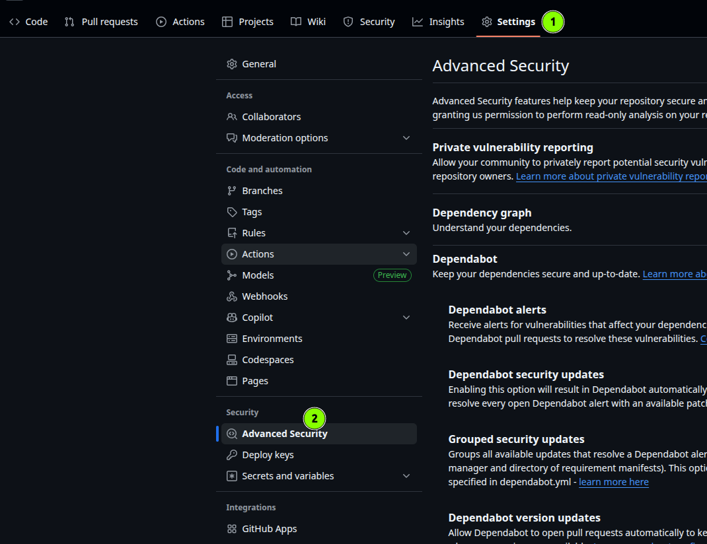
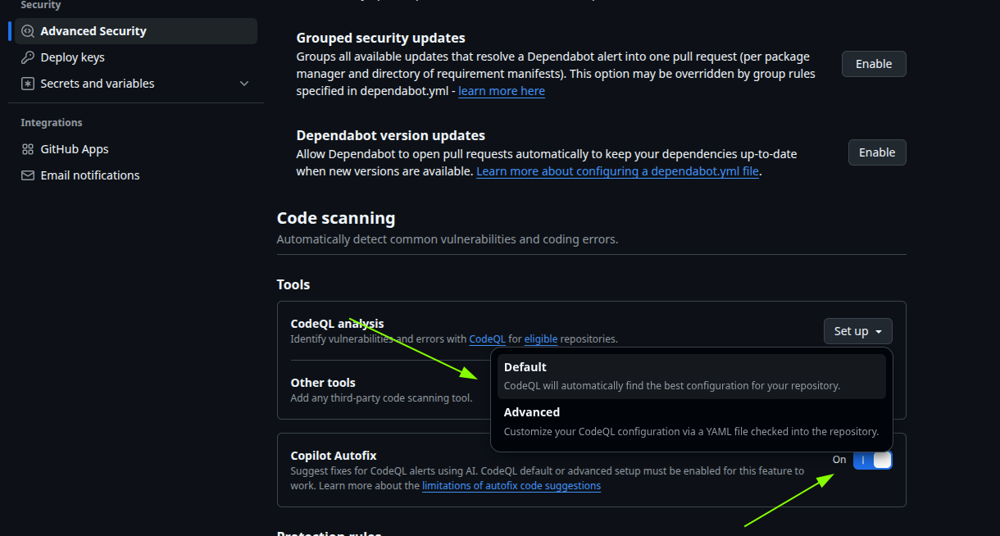
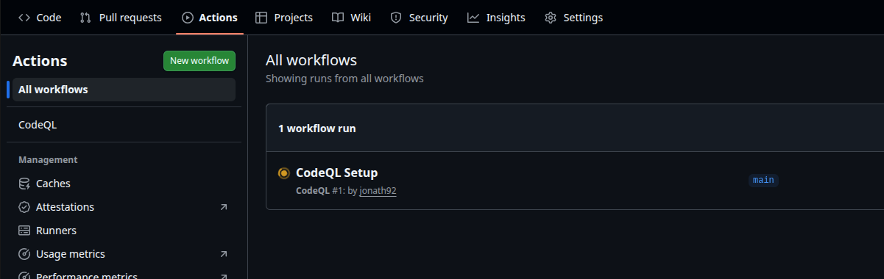
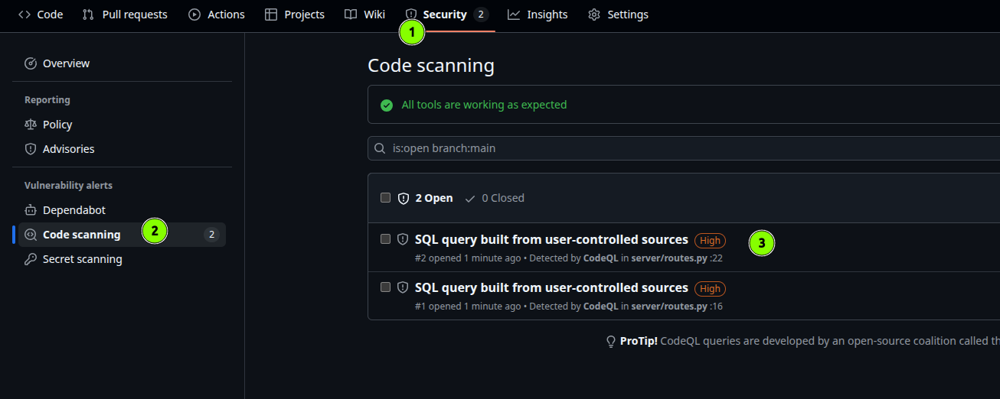
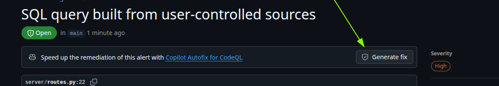

# Introduction
GitHub Advanced Security (GHAS) provides powerful security features to help you identify and remediate vulnerabilities in your code. In combination with GitHub Copilot, you can leverage AI to assist you in fixing security issues more efficiently.

# Task 
- Create a fork of the [demo-python](https://github.com/advanced-security-demo/demo-python) repository to your own GitHub account. 
- Go to --> Settings --> Advanced Security and Setup Code-Scanning. Double check that "Copilot Autofix" is enabled. 

- Go to the "Actions" tab and wait for the "CodeQL Setup" workflow to finish. This might take a couple of minutes.

- Once the workflow is finished, go to the "Security" tab and then to "Code scanning alerts". You should see a list of security issues detected in the codebase.

- Then click on "Generate Fix" 

