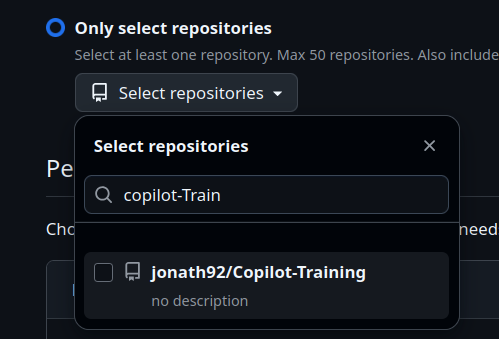
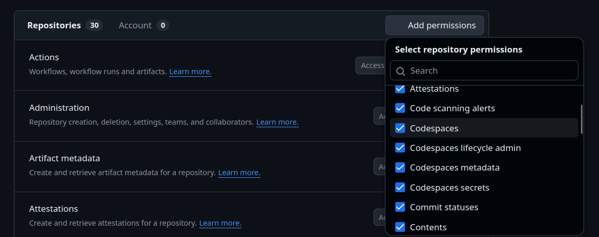

# Introduction 

> Imagine describing your automation needs in plain language instead of wrestling with complex YAML syntax and API calls. GitHub Agentic Workflows makes this possible by transforming natural language markdown files into GitHub Actions that are executed by AI agents (the AI that executes your workflow instructions) [source](https://githubnext.github.io/gh-aw/introduction/overview/)

In this tutorial, we will explore how to use GitHub Agentic Workflows to create a workflow to daily update the documentation of our project. This is just an example use case. The GitHub Agentic Workflows provide many other use cases you can find in the [official documentation](https://githubnext.github.io/gh-aw/introduction/overview/).

> [!WARNING]
> GitHub Agentic Workflows is a research demonstrator in early development and may change significantly

# Tasks
- Install the [GitHub CLI](https://cli.github.com/) 
- Install the agentic workflows extension: 
```
gh extension install githubnext/gh-aw
```
- Add the `Regular Documentation Update` workflow to the repository by running the following command in the terminal:
```
gh aw add githubnext/agentics/update-docs --pr
```
See: https://github.com/githubnext/agentics/blob/main/docs/update-docs.md 

- This creates a pull request that adds the workflow to the repository. Review the changes and merge the pull request.

- Open: https://github.com/settings/personal-access-tokens/new and create a personal access token
    - Set the expiration to 7 days
    - Select repostiory access: 
        - Only selected repositories and choose the repository of this tutorial

        

        - Under "Repositories" enable all permissions: 

        

        For all permissions select "Read and Write"

        > [!WARNING]
        > Selecting all permissions is usually not recommended. It is recommended to delete the PAT after the training.

        - Under "Account" select "Copilot Requests" 

        - Finally click on "Generate Token" and copy the token

    - Now add the PAT as a secret to the repository: 
    ```
    gh secret set COPILOT_GITHUB_TOKEN -a actions --body
    <your-personal-access-token>
    ```

- Now trigger the workflow by running: 
```
git pull
gh aw run update-docs
```